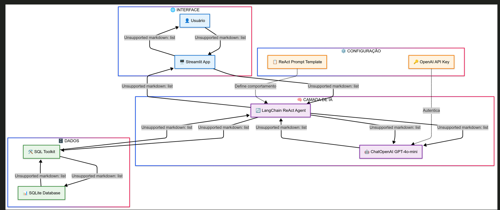
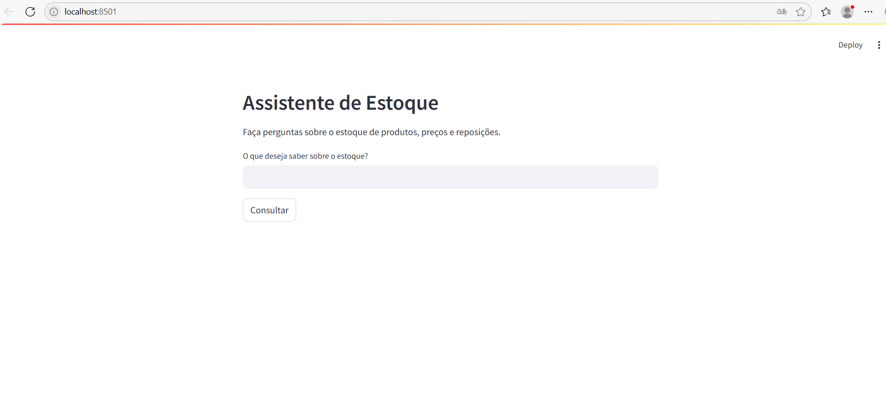
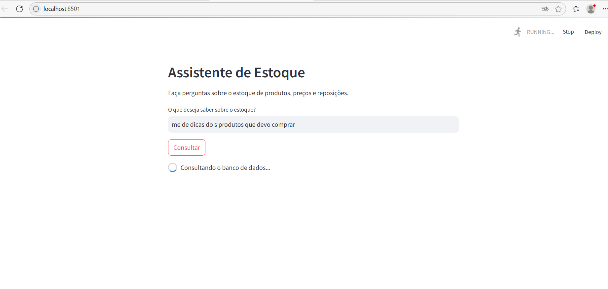
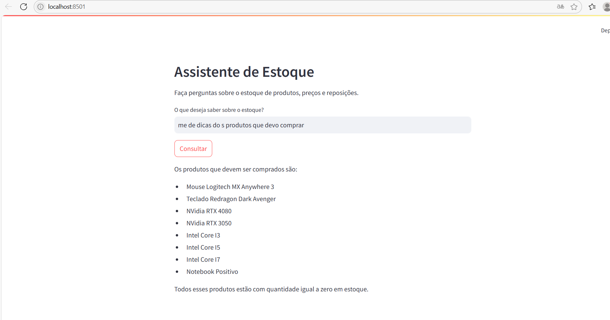
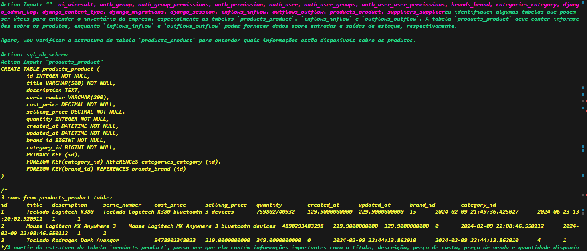

# Estoque GPT 📄

Um assistente inteligente para consultas de estoque utilizando GPT e banco de dados SQL.

## 📋 Descrição

O Estoque GPT é uma aplicação web construída com Streamlit que permite fazer consultas em linguagem natural sobre dados de estoque. Utilizando modelos GPT da OpenAI e LangChain, o sistema converte perguntas em português para consultas SQL e fornece respostas formatadas de forma amigável.




## 🚀 Funcionalidades

- **Consultas em linguagem natural**: Faça perguntas sobre estoque sem precisar conhecer SQL
- **Múltiplos modelos GPT**: Escolha entre diferentes versões do GPT (3.5-turbo, 4, 4-turbo, 4o-mini, 4o)
- **Interface amigável**: Interface web simples e intuitiva
- **Respostas em português**: Todas as respostas são formatadas em português brasileiro
- **Consultas sobre**:
  - Produtos em estoque
  - Preços
  - Reposições necessárias
  - Relatórios de estoque

## 🛠️ Tecnologias Utilizadas

- **Python 3.x**
- **Streamlit**: Interface web
- **LangChain**: Framework para aplicações com LLM
- **OpenAI GPT**: Modelos de linguagem
- **SQLite**: Banco de dados local
- **python-decouple**: Gerenciamento de configurações

## 📦 Instalação

1. Clone o repositório:
```bash
git clone <url-do-repositorio>
cd estoque-gpt
```

2. Instale as dependências:
```bash
pip install streamlit langchain langchain-openai langchain-community python-decouple
```

3. Configure sua chave da OpenAI:
   - Crie um arquivo `.env` na raiz do projeto
   - Adicione sua chave da API:
```
OPENAI_API_KEY=sua_chave_api_aqui
```

4. Certifique-se de que o banco de dados `estoque.db` existe na raiz do projeto

## 🎯 Como Usar

1. Execute a aplicação:
```bash
streamlit run app.py
```

2. Abra o navegador no endereço indicado (geralmente `http://localhost:8501`)

3. Selecione o modelo GPT desejado na barra lateral

4. Digite sua pergunta sobre o estoque no campo de texto

5. Clique em "Consultar" para obter a resposta

## 💡 Exemplos de Perguntas

- "Quantos produtos temos em estoque?"
- "Qual o preço do produto X?"
- "Quais produtos precisam de reposição?"
- "Mostre os produtos com estoque baixo"
- "Qual o valor total do estoque?"
- "Me dê dicas de estoque de produtos que devo repor"

## 🖥️ Interface da Aplicação

A aplicação apresenta uma interface simples e intuitiva com os seguintes elementos:

### Tela Principal
- **Título**: "Assistente de Estoque" 
- **Descrição**: "Faça perguntas sobre o estoque de produtos, preços e reposições"
- **Campo de entrada**: Onde o usuário digita suas perguntas em linguagem natural
- **Botão "Consultar"**: Processa a pergunta e retorna a resposta
- **Área de resposta**: Exibe os resultados da consulta de forma formatada

### Barra Lateral
- **Seletor de modelo**: Dropdown para escolher entre os modelos GPT disponíveis
- **Seção "Sobre"**: Informações sobre o funcionamento do agente

### Exemplo de Funcionamento
Quando o usuário faz a pergunta "Me dê dicas de estoque de produtos que devo repor", o sistema:

1. Processa a pergunta em linguagem natural
2. Converte para consultas SQL no banco de dados
3. Analisa os dados de estoque
4. Retorna uma resposta formatada, como:
   - "Os produtos que você deve repor são o Mouse Logitech MX Anywhere 3, Teclado Redragon Dark Avenger, Nvidia RTX 4080, Nvidia RTX 3050, Intel core i3, Intel core i5, Intel core i7 e Notebook Positivo."

### Recursos da Interface
- **Design responsivo**: Funciona bem em diferentes tamanhos de tela
- **Feedback visual**: Spinner de carregamento durante as consultas
- **Validação**: Avisos quando campos obrigatórios não são preenchidos
- **Formatação**: Respostas apresentadas de forma clara e organizada

## 🗄️ Estrutura do Banco de Dados

O sistema espera um banco de dados SQLite (`estoque.db`) com tabelas relacionadas ao controle de estoque. A estrutura exata das tabelas pode variar, mas geralmente inclui:

- Produtos
- Preços
- Quantidades em estoque
- Datas de reposição

## ⚙️ Configuração

### Variáveis de Ambiente

Crie um arquivo `.env` com as seguintes configurações:

```
OPENAI_API_KEY=sua_chave_da_openai
```

### Modelos Disponíveis

- `gpt-3.5-turbo`: Mais rápido e econômico
- `gpt-4`: Mais preciso para consultas complexas
- `gpt-4-turbo`: Equilibrio entre velocidade e precisão
- `gpt-4o-mini`: Versão otimizada e econômica
- `gpt-4o`: Versão mais recente e avançada

## 🔧 Estrutura do Código

```
estoque-gpt/
├── app.py              # Aplicação principal
├── estoque.db          # Banco de dados SQLite
├── .env                # Variáveis de ambiente
├── requirements.txt    # Dependências (opcional)
└── README.md          # Este arquivo
```

## 📋 Requisitos

- Python 3.8+
- Chave da API OpenAI
- Banco de dados SQLite com dados de estoque

## 🤝 Contribuição

Contribuições são bem-vindas! Sinta-se à vontade para:

1. Fazer fork do projeto
2. Criar uma branch para sua feature
3. Commit suas mudanças
4. Push para a branch
5. Abrir um Pull Request

## 📄 Licença

Este projeto está sob a licença MIT. Veja o arquivo `LICENSE` para mais detalhes.

## 🆘 Suporte

Se você encontrar algum problema ou tiver dúvidas:

1. Verifique se todas as dependências estão instaladas
2. Confirme se a chave da API OpenAI está configurada corretamente
3. Certifique-se de que o banco de dados `estoque.db` existe e contém dados

## 🔮 Próximas Funcionalidades

- [ ] Suporte a diferentes tipos de banco de dados
- [ ] Exportação de relatórios
- [ ] Histórico de consultas
- [ ] Gráficos e visualizações
- [ ] Autenticação de usuários


## Evidências









acesso ao banco de dados :

